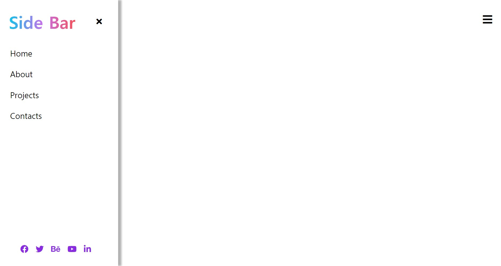

# Side-Bar

 
<ol>
  <li><strong>프로젝트 이름</strong> : Side Bar</li>
  <li><strong>사용 언어</strong> : HTML, CSS, Vanila Javascript</li>
  <li><strong>주요 기능</strong> 
    <ul>
      <li>화면 우측 상단 Side Bar 호출 버튼을 클릭시, 숨어있던 Side bar가 표시됩니다.</li>
    </ul>
   </li> 
  <li><strong>배운점</strong>: Side Bar를 열때, 페이지의 레이아웃은 물론 Side Bar내부의 글자들이 모두 뭉개지고 자기 자리를 벗어나며 
    불러와지는 문제가 발생했다. : 단순 Side Bar의 width를 키우는 것이 아니라, css의 translate animation을 활용해 width 변경없이 side Bar를 불러와서 해결!</li>

   

  <h5> 실행화면 </h5>
  
  

  

